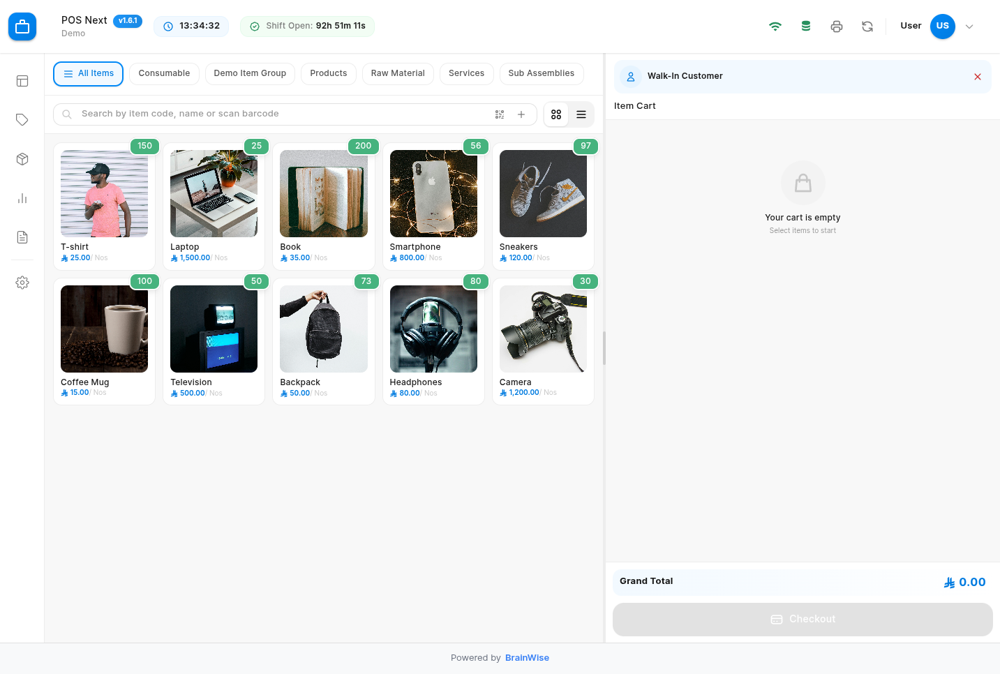
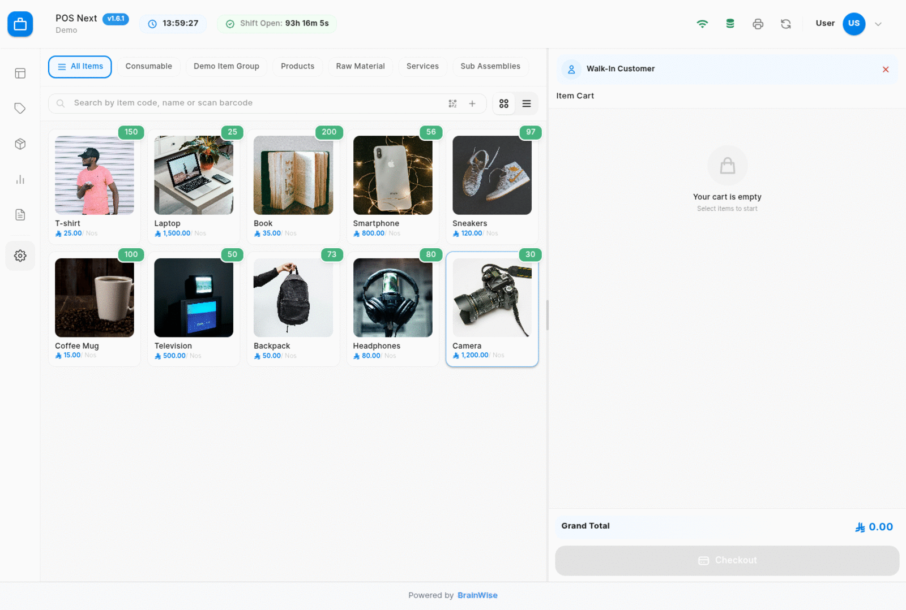
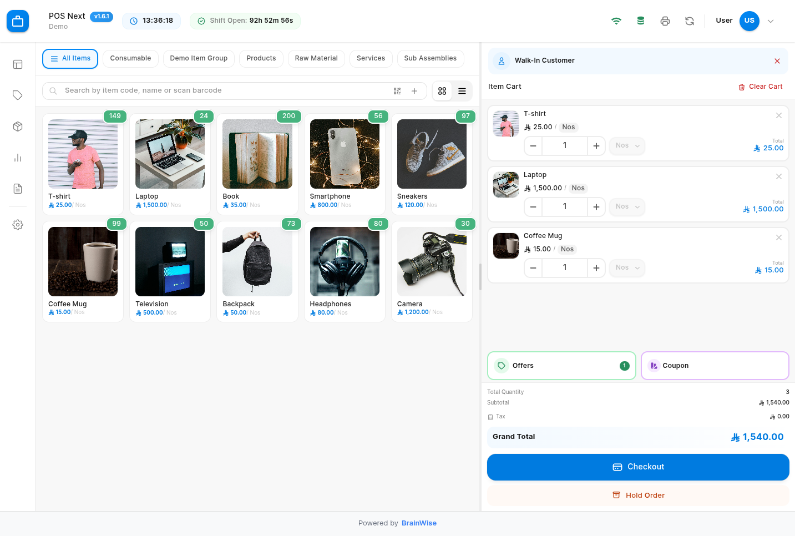
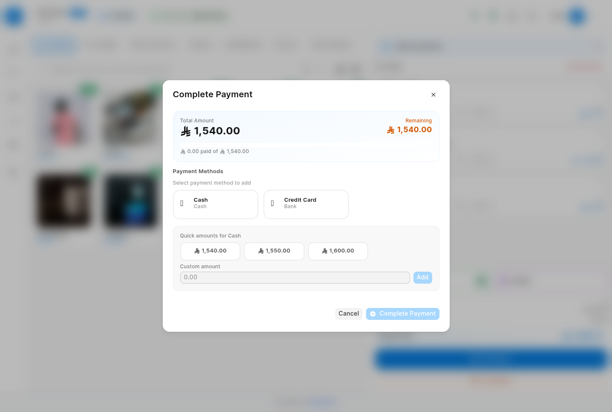
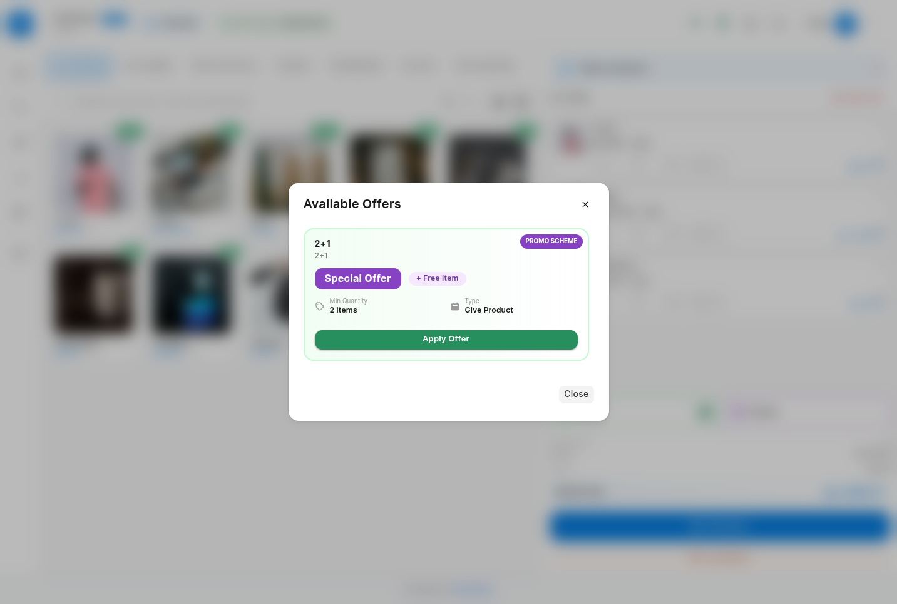
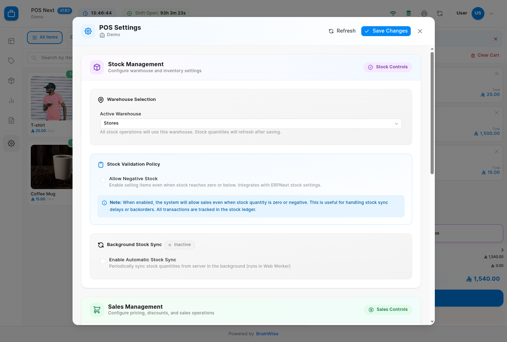

# POS Next

<div align="center">



**A modern, lightning-fast Point of Sale system for ERPNext**

[](LICENSE)
[](https://github.com/frappe/frappe)
[](https://github.com/frappe/erpnext)

[Features](#-features) • [Installation](#-installation) • [Quick Start](#-quick-start) • [Demo](#-demo) • [Documentation](#-documentation)

</div>

---

## 🎯 Why POS Next?

POS Next is a **complete rewrite** of the ERPNext POS system, built from the ground up with modern technologies to deliver:

- ⚡ **Blazing Fast Performance** - Vue 3 + Vite for instant load times
- 🔄 **True Offline Support** - Keep selling even when your internet drops
- 💎 **Modern UI/UX** - Clean, intuitive interface your staff will love
- 🎁 **Advanced Promotions** - Full-featured offers, coupons, and gift cards
- 💰 **Smart Payments** - Multiple payment methods, partial payments, split bills
- 📊 **Real-time Insights** - Live shift tracking and instant reports

## 📸 See It In Action

### Complete Sales Cycle



## 📞 Support & Community

- 🐛 **Bug Reports**: [GitHub Issues](https://github.com/BrainWise-DEV/pos_next/issues)
- 💬 **Discussions**: [GitHub Discussions](https://github.com/BrainWise-DEV/pos_next/discussions)
- 📖 **Forum**: [Frappe Community](https://discuss.frappe.io/)
- 📱 **Telegram Group**: [Join our community](https://t.me/+J2WHnNKCn8ZhOWQ0) - Get help, share ideas, and connect with other users
- 📧 **Email**: support@brainwise.me

### Key Features

<table>
  <tr>
    <td width="50%">
      
      <p align="center"><b>Intuitive Shopping Cart</b><br/>Add items instantly with barcode scanning or search</p>
    </td>
    <td width="50%">
      
      <p align="center"><b>Smart Payment Processing</b><br/>Multiple payment methods, quick amounts, partial payments</p>
    </td>
  </tr>
  <tr>
    <td width="50%">
      
      <p align="center"><b>Promotional Schemes</b><br/>Buy X Get Y, discounts, bundle offers, and more</p>
    </td>
    <td width="50%">
      
      <p align="center"><b>Comprehensive Settings</b><br/>Flexible configuration for every business need</p>
    </td>
  </tr>
</table>

## ✨ Features

### Core Functionality

- 🚀 **Modern Tech Stack**
  - Vue 3 with Composition API
  - Vite for lightning-fast builds
  - Tailwind CSS for beautiful UI
  - TypeScript-ready architecture

- 🔄 **Offline-First Architecture**
  - IndexedDB for local data caching
  - Background sync when online
  - Web Workers for smooth performance
  - Service Worker for true PWA support

- 💰 **Advanced Payment Options**
  - Multiple payment methods per transaction
  - Partial payments with tracking
  - Quick amount buttons for faster checkout
  - Change calculation and write-off
  - Credit sale support with approval

- 🎁 **Promotional Engine**
  - **Coupons**: Percentage, fixed amount, free items
  - **Promotional Schemes**: Buy X Get Y, tiered discounts
  - **Gift Cards**: Full gift card management
  - Auto-apply eligible offers
  - Stack multiple promotions

- 💱 **Multi-Currency Support**
  - Proper currency symbols (E£, ر.س, د.إ, $, €, £)
  - Real-time exchange rates
  - Currency-specific formatting

- 💾 **Draft Invoices (Hold Orders)**
  - Save incomplete transactions
  - Resume from any device
  - Automatic cleanup
  - Badge count indicator

- 🔄 **Returns Management**
  - Quick return invoice processing
  - Partial or full returns
  - Auto-credit note generation
  - Stock adjustment

- 💼 **Shift Management**
  - Open/close shift workflow
  - Live shift timer in navbar
  - Shift-wise sales reports
  - Cash reconciliation

- 🔍 **Smart Search**
  - Real-time item search
  - Barcode scanning support
  - Item group filtering
  - Keyboard shortcuts (F4, F8, F9)

- 📱 **Responsive Design**
  - Desktop optimized
  - Tablet friendly
  - Touch-screen ready
  - Grid and list views

### Technical Features

- 🔥 **Performance Optimized**
  - Virtual scrolling for large inventories
  - Lazy loading components
  - Debounced search
  - Optimistic UI updates

- 🔒 **Enterprise Ready**
  - Role-based permissions
  - Audit trail logging
  - Multi-warehouse support
  - Tax compliance ready

- 🌐 **Internationalization**
  - RTL support ready
  - Multi-language capable
  - Regional formats

## 📋 Prerequisites

- **Frappe Framework** version 15 or higher
- **ERPNext** version 15 or higher
- Modern browser (Chrome, Firefox, Safari, Edge)

## 🚀 Installation

### Fresh Installation

```bash
# Navigate to your bench
cd ~/frappe-bench

# Get the app from GitHub
bench get-app https://github.com/BrainWise-DEV/pos_next.git --branch develop

# Install on your site
bench --site [your-site-name] install-app pos_next

# Run migrations
bench --site [your-site-name] migrate

# Build assets
bench build --app pos_next

# Restart (production only)
bench restart
```

### Development Setup

```bash
# Get app in dev mode
cd ~/frappe-bench
bench get-app /path/to/pos_next

# Install frontend dependencies
cd apps/pos_next/POS
npm install

# Run dev server with hot reload
npm run dev

# In another terminal, start Frappe
bench start
```

## 🎯 Quick Start

### 1. Setup POS Profile

Navigate to: **Retail > POS Profile > New**

Configure:
- Company and Warehouse
- Price List and Currency
- Payment Methods (Cash, Card, etc.)
- Default Customer (Walk-In)

### 2. Access POS

Visit: `https://your-site.com/pos` or `http://localhost:8000/pos`

### 3. Make Your First Sale

1. **Search Items** - Press `F4` or scan barcode
2. **Add to Cart** - Click items or use auto-add mode
3. **Select Customer** - Press `F8` (optional)
4. **Apply Offers** - Green button shows available offers
5. **Checkout** - Press `F9`, select payment method
6. **Print** - Receipt prints automatically

### Optional: Create Promotional Offers

**POS Offer**: `POS Next > POS Offer > New`
**POS Coupon**: `POS Next > POS Coupon > New`

## ⌨️ Keyboard Shortcuts

| Shortcut | Action |
|----------|--------|
| `F4` | Search items |
| `F8` | Search customers |
| `F9` | Proceed to checkout |
| `Ctrl+S` | Save draft (hold order) |
| `Esc` | Close dialog |


## 🏗️ Build for Production

```bash
cd apps/pos_next/POS
npm run build
bench build --app pos_next
bench restart
```

## 🔌 API Reference

### Get Available Offers

```python
frappe.call({
    method: 'pos_next.api.offers.get_offers',
    args: {
        pos_profile: 'Main POS',
        customer: 'CUST-00001'
    },
    callback: (r) => console.log(r.message)
})
```

### Validate Coupon

```python
frappe.call({
    method: 'pos_next.api.offers.validate_coupon',
    args: {
        coupon_code: 'SUMMER2024',
        customer: 'CUST-00001',
        company: 'My Company',
        grand_total: 1000
    },
    callback: (r) => console.log(r.message)
})
```

### Create Invoice

```python
frappe.call({
    method: 'pos_next.api.invoices.create_invoice',
    args: {
        invoice_data: {
            customer: 'CUST-00001',
            items: [
                { item_code: 'ITEM-001', qty: 2, rate: 100 }
            ],
            payments: [
                { mode_of_payment: 'Cash', amount: 200 }
            ]
        }
    },
    callback: (r) => console.log(r.message)
})
```

## 🤝 Contributing

We welcome contributions! Here's how:

1. **Fork** the repository
2. **Create** a feature branch: `git checkout -b feature/amazing-feature`
3. **Install** pre-commit hooks: `cd apps/pos_next && pre-commit install`
4. **Make** your changes
5. **Test** thoroughly
6. **Commit** with clear messages
7. **Push** to your fork
8. **Open** a Pull Request

